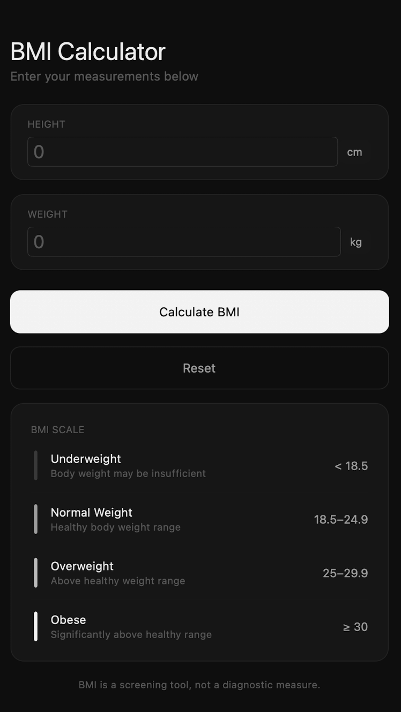
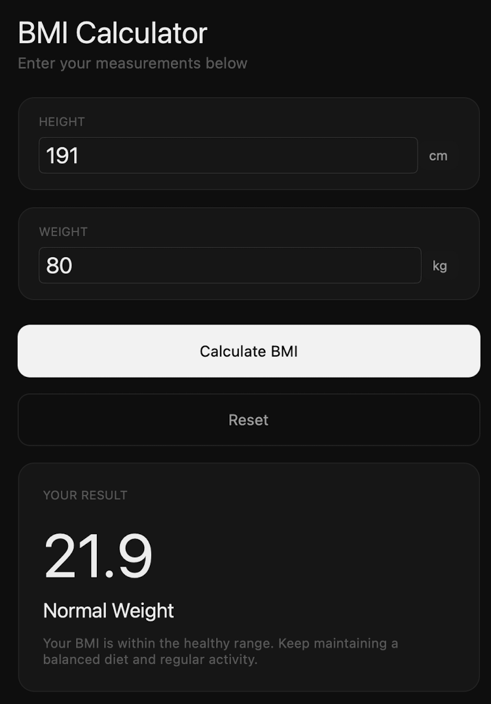
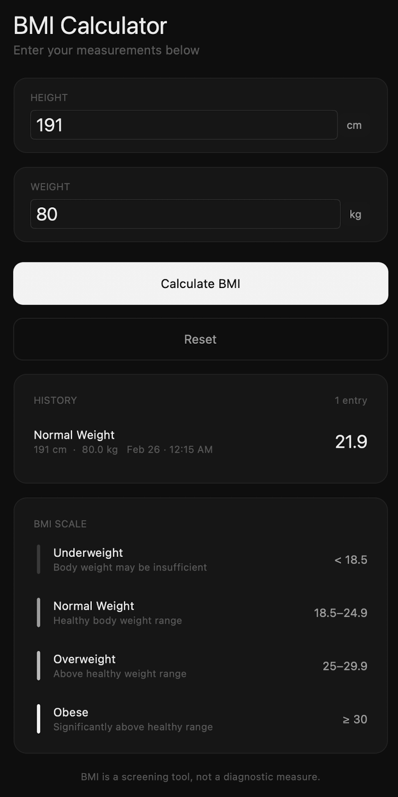

# BMI Calculator

**CIS 2203N — Activity**

A .NET MAUI mobile app that calculates Body Mass Index (BMI) from height and weight inputs.

## Features

- Height (cm) and weight (kg) input with validation
- BMI result with category (Underweight / Normal Weight / Overweight / Obese)
- Calculation history (newest first, scrollable after 10 entries)
- BMI scale reference card

## Demo

| Empty State | Result | History & Scale |
|:-----------:|:------:|:---------------:|
|  |  |  |

## Tech Stack

