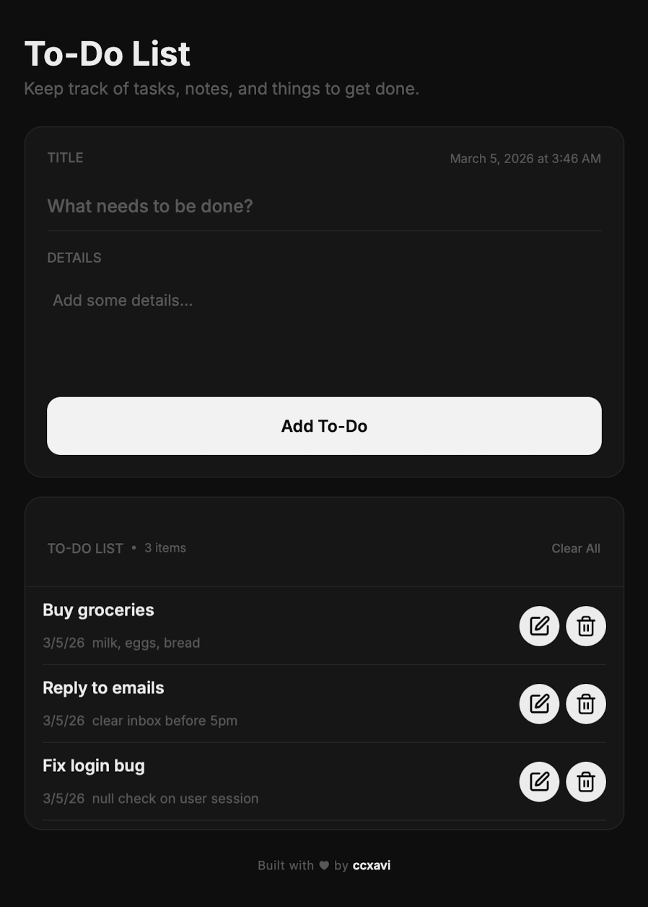

# To-Do List

**CIS 2203N — Activity**

A .NET MAUI mobile app for managing personal tasks and notes.

## Features

- Add, edit, and delete to-do items
- Last modified timestamp displayed per item
- Confirmation dialogs for delete and clear all
- Scrollable list (up to 10 visible items)

## Demo

## Tech Stack

